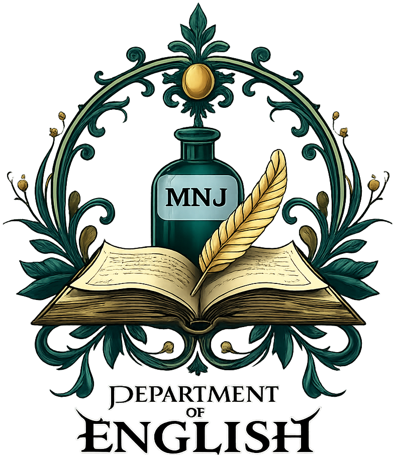

# Research Document Management System (RDMS) - IIUI

Welcome to the **Research Document Management System (RDMS)** for the **International Islamic University Islamabad (IIUI)**. This platform is designed to streamline and modernize the research management workflow for students, coordinators, and faculty members.



## Overview

The RDMS is a comprehensive web application built with **Next.js 14** aimed at facilitating the submission, review, and management of academic research documents. It prioritizes efficiency, communication, and clear tracking of research progress.

### Key Features

-   **Role-Based Access Control**: specialized dashboards for Students and Coordinators.
-   **Real-Time Communication**: dedicated chat interface for seamless interaction between students and their supervisors/coordinators.
-   **Document Management**: secure submission and review processes for research proposals, theses, and reports.
-   **Modern User Interface**: responsive and accessible design powered by Tailwind CSS and Shadcn UI components.
-   **Cloud-Native Backend**: leveraging **Supabase** for robust authentication, database management, and real-time capabilities.

## Tech Stack

This project is built using the following modern web technologies:

-   **Framework**: [Next.js 14](https://nextjs.org/) (App Router)
-   **Language**: [TypeScript](https://www.typescriptlang.org/)
-   **Styling**: [Tailwind CSS](https://tailwindcss.com/)
-   **Backend & Auth**: [Supabase](https://supabase.com/)
-   **UI Components**: [Shadcn UI](https://ui.shadcn.com/) / Radix UI
-   **State Management**: React Hooks & Context
-   **Icons**: Lucide React
-   **Fonts**: [Lexend](https://fonts.google.com/specimen/Lexend) & Geist

## Getting Started

Follow these instructions to set up the project locally on your machine.

### Prerequisites

-   **Node.js**: Ensure you have Node.js (v18 or higher) installed.
-   **npm / yarn / pnpm**: A package manager of your choice.
-   **Supabase Account**: You will need a Supabase project for the backend.

### Installation

1.  **Clone the repository:**
    ```bash
    git clone https://github.com/your-username/rdms.git
    cd rdms
    ```

2.  **Install dependencies:**
    ```bash
    npm install
    # or
    yarn install
    # or
    pnpm install
    ```

3.  **Environment Setup:**
    Create a `.env.local` file in the root directory and add your Supabase credentials:
    ```env
    NEXT_PUBLIC_SUPABASE_URL=your_supabase_project_url
    NEXT_PUBLIC_SUPABASE_ANON_KEY=your_supabase_anon_key
    ```

4.  **Run the Development Server:**
    ```bash
    npm run dev
    ```

5.  Open [http://localhost:3000](http://localhost:3000) in your browser to view the application.

## Project Structure

The project follows the standard Next.js App Router structure:

```
rdms/
├── app/                  # Application routes and layouts
│   ├── dashboard/        # Dashboard pages (Student, Coordinator)
│   ├── api/              # API routes
│   └── ...
├── components/           # Reusable UI components
│   ├── chat/             # Chat interface components
│   └── ui/               # Base UI elements (buttons, inputs, etc.)
├── lib/                  # Utility functions and library configuratons
│   └── supabase/         # Supabase client setup
├── public/               # Static assets (images, icons)
└── styles/               # Global styles (globals.css)
```

## Contributing

Contributions to improve the RDMS are welcome. Please ensure to follow the established coding standards and submit a pull request for review.


## License

This project is private property and no license is available.
